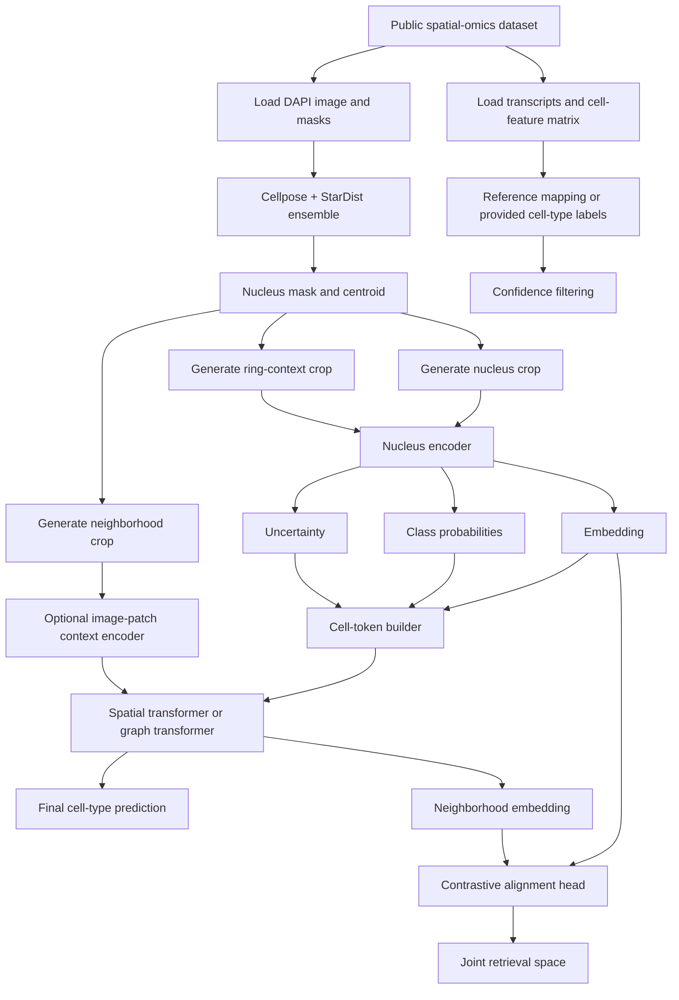
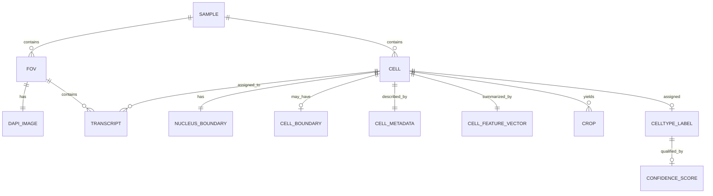
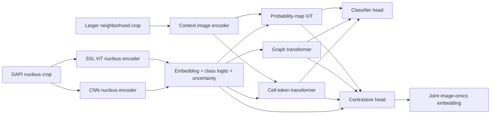

# DAPI-Only Cell Typing From Spatial-Omics Supervision

## Executive summary

Your proposed pipeline is technically coherent and, in its overall decomposition, aligns well with the strongest ideas scattered across several currently separate literatures: robust nuclear segmentation, self-supervised or strongly regularized single-cell representation learning, explicit spatial-context modeling, and contrastive multimodal alignment. What is *not* yet common in the literature is the exact combination you want: **DAPI-only nucleus imaging, trained with cell-type labels derived from single-cell spatial omics, then refined with tissue context, and finally embedded into a retrieval-friendly joint space**. Among the screened works, **NuSPIRe** is the closest to your nucleus-centric, DAPI-only ambition; **Cell-DINO** and **LEMON** are the closest on the representation-learning side; **HEIST** is the closest on the spatial-context side; and **TITAN**, **BLEEP**, **OmiCLIP**, and **ST-Align** are the closest on the multimodal alignment side. But none of them implements your full end-to-end design exactly. citeturn3view3turn5view0turn6view2turn14view1turn18view0turn24view0turn42search15turn42search5turn42search1

The most practical route for your project is therefore **not** to search for a single paper to copy, but to assemble a training stack from public spatial imaging datasets that already expose the right artifacts: DAPI morphology images, transcript coordinates, cell IDs, and nucleus/cell boundaries. In practice, the best public starting points are **CosMx** for high-resolution single-cell labels and transcript locations, **10x Xenium** for standardized file outputs and strong programmatic interoperability, and **Vizgen MERFISH / SEA-AD** for large-scale public spatial references. **HEST-1k** is extremely useful too, but more for image–omics alignment and broader pretraining than for DAPI-only nucleus crops because it centers on histology-plus-spatial-transcriptomics rather than nuclear fluorescence. citeturn39search3turn36view0turn38view0turn38view4turn39search5turn36view6turn39search4turn34search11turn40search0turn40search7

The strongest implementation recommendation is a staged system. First, train a **nucleus encoder** on DAPI crops with explicit border context and uncertainty outputs. Second, construct a **cell-token spatial model** that consumes nucleus embeddings, class probabilities, uncertainty, and coordinates. Third, attach a **contrastive head** that aligns image-derived embeddings to transcriptomics-derived cell-type prototypes, or to text/prototype descriptions if you want CLIP-like retrieval. This design is more faithful to the evidence than trying to jump directly to a large Vision Transformer over raw DAPI tissue patches. The literature strongly suggests that representation quality, spatial reasoning, and multimodal alignment each benefit from being explicitly modeled rather than assumed to emerge from a single monolithic network. citeturn4view2turn6view2turn19view6turn24view3turn42search15turn42search5turn42search1

A key caution is label trustworthiness. Public spatial-omics datasets do **not** all deliver equally strong cell-type labels out of the box. Some provide downstream annotations directly; others provide only counts, coordinates, and boundaries, requiring you to run reference mapping or clustering yourself. For this reason, your training set should be built with **confidence-filtered labels**, patient-level splits, and explicit ablations against segmentation error and neighborhood leakage. Otherwise, a DAPI-only model can easily learn platform, patient, or tissue-region shortcuts instead of transferable cell-type morphology. citeturn35search1turn35search4turn35search10turn20view4turn26view0turn28view4

## Prior conversation distilled into a concrete research program

The pipeline from our prior discussion can be restated as a four-stage program.

First, perform **high-quality nucleus segmentation** on DAPI using a **Cellpose + StarDist ensemble**, with optional consensus or arbitration logic. That stage is well supported by current benchmarking: in multiplex immunofluorescence settings, deep models consistently outperform classical pipelines; Mesmer is the strongest general-purpose baseline overall, while StarDist is much faster and Cellpose can do better in dense nuclear regions such as tonsil-like tissue. This benchmark supports your instinct that segmentation should be treated as a first-class engineering problem, not a preprocessing footnote. citeturn26view0turn27view6turn27view7

Second, train a **nucleus-level classifier/encoder** on cropped nuclei plus a controlled border ring so that perinuclear RNA-rich context can contribute signal. The desirable outputs are not just class logits, but also **embeddings** and **uncertainty**. This stage is strongly aligned with NuSPIRe’s DAPI-only nuclear representation learning and with Cell-DINO’s demonstration that self-supervised features can become far more label-efficient than direct supervised training. It also aligns conceptually with LEMON’s “foundation model for nuclear morphology,” even though LEMON is built on H&E nuclei rather than DAPI. citeturn5view0turn4view3turn6view2turn8view0turn14view1

Third, build a **spatial context model** over larger neighborhoods. The best way to operationalize your question — whether a Vision Transformer can “use the recognized cell types from step 2 and assign them in space” — is to avoid forcing the transformer to rediscover those types from raw pixels. Instead, represent each nucleus as a token with its embedding, class-probability vector, uncertainty, coordinates, size/shape descriptors, and perhaps local density. HEIST is important here because it shows that hierarchical models benefit from explicit cross-level message passing rather than collapsing all information into one flat representation. TITAN is also relevant because it shows how attention-based global context can be layered on top of compact local encoders. So yes: a ViT- or graph-transformer-style spatial model **can** use step-2 cell-type predictions and localization, but it should do so explicitly through token design and positional structure. citeturn18view0turn19view6turn24view1turn24view3

Fourth, fit a **contrastive retrieval head** — your “CLIP step” — to place DAPI-derived morphology in a joint vector space with one of three targets: transcriptomic cell-type prototypes, text descriptions of cell types, or paired image–omics neighborhoods. The most relevant analogs are TITAN, BLEEP, OmiCLIP, and ST-Align. These works do not solve DAPI-only cell typing directly, but they strongly support the idea that alignment losses make embeddings more reusable, more interpretable, and more useful for zero-shot or retrieval tasks than plain classification-only encoders. citeturn24view3turn42search15turn42search5turn42search1

The result is that your overall plan is not only plausible; it is unusually well structured. What the literature suggests is mainly that the interfaces between stages matter: **segmentation quality**, **tokenization choices**, and **label confidence** will be more decisive than whether the backbone is “CNN versus ViT” in the abstract. citeturn26view0turn27view6turn6view2turn18view0

## Detailed screening of the previously discussed core works

| Work | Concise summary | Modality | Architecture and objective | Training data sources and size | How labels or ground truth were created | Evaluation and key results | Similarity to your approach | DAPI-only limitations | Primary sources |
|---|---|---|---|---|---|---|---|---|---|
| **NuSPIRe** | Self-supervised pretraining on DAPI-stained nuclei to learn nuclear morphology representations, then fine-tuned for downstream tasks including NSCLC tumor-immune cell-type identification. | **DAPI-only nuclear images** and downstream spatial-omics applications. | Masked autoencoder-style transformer with **12 encoder blocks / 12 heads** and **8 decoder blocks / 16 heads**; 75% mask ratio, patch size 8×8, hidden size 768; grayscale preprocessing with random resized crop to 112×112. Objective: reconstruction MSE in SSL pretraining, then supervised fine-tuning. | Pretrained on **NuCorpus-15M**; accessible HTML confirms pretraining on this large-scale nuclear image corpus but does **not fully specify** its source composition in the parsable text. Downstream tasks include an NSCLC DAPI cell-typing task and external perturbation/senescence datasets; CPJUMP1 subset reported at **1,423,075 cells** and senescence set at **30,000 nuclei**. | For the NSCLC cell-typing task, the paper demonstrates tumor / lymphocyte / other classification from DAPI-stained nuclei, but the parsable primary text does **not fully expose** the exact spatial-omics label-generation pipeline. This is an important unresolved detail. By contrast, the senescence and perturbation tasks use experimentally defined labels, and nuclei were segmented/cropped with CellProfiler in the senescence example. | Reported metrics include **accuracy, macro F1, precision, recall, AUROC, MCC, and Cohen’s κ**. Figure text states NuSPIRe outperformed VGG, ResNet, Swin, ConvNeXt, EfficientNet, and ViT, and retained stronger performance at low labeled sample sizes; exact per-task numeric tables for NSCLC were not fully exposed in the accessible HTML. | **Closest match** to your pipeline’s nucleus-centric DAPI-only representation-learning stage. | The critical missing piece is the fully documented spatial-omics supervision pipeline; without checking supplement/code, reproducibility of the label-generation step remains incomplete. | citeturn4view2turn4view3turn3view3turn5view0 |
| **Cell-DINO** | Adapts DINOv2 self-supervision to fluorescent cell microscopy; produces strong reusable embeddings and large gains in low-label regimes. | Multi-channel fluorescent microscopy, **not** DAPI-only and **not** cell-type-from-spatial-omics. | ViT-Large with microscopy-specific channel handling and augmentations; student–teacher DINOv2 framework with cross-entropy self-distillation plus iBOT/Koleo losses. | Separate pretraining on **HPA-FoV 200K**, **HPA-SC 500K**, and **combined Cell Painting 5M** image datasets. HPA uses 4 channels; Cell Painting uses 5 channels. | No cell-type labels are used in SSL pretraining. Downstream labels are expert protein-localization labels, cell line labels, mechanism-of-action labels, and treatment labels. HPA single-cell crops were produced with the HPA-Cell-Segmentation algorithm based on pretrained U-Nets; Cell Painting segmentation used CellProfiler with Hoechst Otsu thresholding plus watershed in ER/RNA channels. | On the most challenging HPA single-cell protein localization task using only 1% labels, Cell-DINO performed **70% better than supervised** and **24% better than another SSL alternative**; it ranked in the **top 8.8% and 11.6%** of FoV and SC Kaggle submissions and had only **0.014 / 0.077** absolute-point gaps from specialized supervised competitors in those competition settings. | Very relevant for your **step-2 encoder**: it strongly supports using SSL on microscopy crops and then fine-tuning with few labels. | Not DAPI-only, no spatial tissue context, and no spatial-omics-derived cell-type supervision. | citeturn7view1turn7view2turn7view3turn6view2turn8view0turn8view2turn8view4 |
| **LEMON** | A self-supervised foundation model for **nuclear morphology in computational pathology**. | H&E / histology single-cell nuclear images, not DAPI. | Vision Transformer **ViT-S/8**; self-supervised training; 40×40 inputs at 0.25 µm/px; outputs 384-d features. | Official model card states training on **10 million histology cell images** sampled from **10,000 TCGA slides**. OpenReview/ArXiv abstract says training spans millions of cell images from diverse tissues and cancer types. Exact organ/tissue breakdown is not exposed in the accessible primary HTML. | Pretraining is self-supervised and unlabeled. Downstream benchmarks include MIDOG25, NuCLS, PanNuke, and HEST-related tasks. The accessible primary sources do not fully list each label-generation pipeline, but benchmark labels come from task-specific existing annotations rather than spatial-omics cell typing. | Primary accessible sources confirm evaluation on **five benchmark datasets**. Public PDF snippets indicate benchmark metrics include **balanced accuracy** for MIDOG25/NuCLS/PanNuke tasks and **Pearson correlation** for HEST-related gene-expression prediction, but full numeric benchmark tables are not fully available through the primary HTML we could inspect. | Strongly relevant as a **nuclear foundation-model precedent**, especially for decoupling nucleus representation learning from downstream tasks. | Modality mismatch: H&E nuclei are very different from DAPI morphology; labels are not spatial-omics-derived cell types. | citeturn14view0turn14view1turn13search3turn15search2 |
| **HEIST** | Hierarchical graph foundation model for spatial transcriptomics and proteomics; learns cell and gene embeddings with explicit spatial structure. | Spatial transcriptomics and spatial proteomics; **no image input**. | Hierarchical graph transformer: a spatial **cell graph** at the higher level and **cell-type-specific gene co-expression network graphs** at the lower level; uses intra-level and cross-level message passing. Objective: **spatially aware contrastive learning + masked autoencoding**. | Pretrained on **22.3M cells** from **124 tissue slices** across **15 organs** using **10x Genomics (13.3M cells)**, **Vizgen (8.7M)**, and **SEA-AD (360k)**. | Preprocessing removes outliers, normalizes expression, keeps highly variable genes, applies MAGIC denoising, then builds gene co-expression networks. If cell-type annotations are available, HEIST uses them directly; otherwise it uses **Leiden clustering** to infer putative cell types before building cell-type-specific co-expression graphs. For downstream **cell type annotation**, it uses dataset-provided annotations and trains only an MLP head on frozen embeddings. | HEIST achieves SOTA across multiple tasks. For cell-type annotation, it was best on **four of five** datasets and reported gains of **28.7%** and **17.9%** on the UPMC and DFCI neck datasets. For clustering, NMI reached **0.691** on SEA-AD and **0.297** on Charville. It is reported as **8× faster than scGPT-spatial** and **48× faster than scFoundation** for embedding extraction. | This is the clearest analogue for your **step-3 spatial-context model**. It directly supports the idea of using structured tokens and explicit spatial reasoning instead of hoping raw-image context alone will suffice. | It has no DAPI image branch and therefore cannot tell you how much cell type is recoverable from morphology alone. | citeturn18view0turn19view0turn19view6turn20view4turn20view6turn20view7turn20view3 |
| **TITAN** | Multimodal whole-slide foundation model for pathology using SSL plus vision–language alignment. | Whole-slide pathology images with reports and synthetic captions; not DAPI, not single-nucleus. | Slide-level ViT with **six transformer layers**, 12 heads, dim 768; stage 1 uses student–teacher knowledge distillation on visual data; stages 2–3 use **CoCa-style** image–text alignment with attentional pooling and text encoder / multimodal decoder reused from CONCHv1.5. | Pretraining uses **Mass-340K** with **335,645 WSIs** and **182,862 medical reports** across **20 organs**. Stage 2 adds **423,122** ROI-caption pairs generated by PathChat from 8,192×8,192 ROI crops. Stage 3 aligns **182,862** WSI-report pairs from in-house reports and GTEx-related pathology notes. | Labels are not cell-type labels. Supervision comes from SSL at stage 1, synthetic captions at stage 2, and cleaned/re-written slide-specific reports at stage 3. Captions were generated after K-means selection of representative tiles from each ROI, then diversified with Qwen2. | Reported to outperform prior ROI and slide foundation models across linear probing, few-shot, zero-shot, rare-cancer retrieval, cross-modal retrieval, and report generation. On a rare-cancer external retrieval task, TITAN and TITAN_V improved **Accuracy@K by +30.8% and +41.5%** over the next best model. | Most relevant to your **step-4 CLIP-style alignment idea** and to global-context modeling. | It is far from your target modality and scale: H&E WSIs, clinical reports, and slide-level tasks do not answer DAPI-only cell typing directly. | citeturn24view0turn24view1turn24view2turn24view3turn23view4turn22view2 |
| **Mesmer / Cellpose / StarDist benchmark** | Practical benchmark for DAPI nuclear segmentation in multiplex immunofluorescence translational workflows. | Spectrally unmixed **DAPI** from mIF; segmentation only. | Benchmark compares classical tools and pretrained DL models. Mesmer uses a **ResNet50 + FPN with four heads** and is trained on TissueNet; Cellpose is a U-Net-like generalist model predicting flows / masks; StarDist predicts star-convex instances and uses NMS. | Benchmark evaluates across **~20,000 labeled nuclei** spanning **7 tissue types**. Mesmer’s underlying training data: **>1 million manually labeled cells / 1.2M nuclei** from TissueNet across **9 organs** and **6 imaging platforms**. Cellpose was trained on **>70,000 segmented objects** from highly varied cell images. StarDist’s released fluorescent nuclei model is trained on a subset of **DSB 2018**, and its H&E model on **MoNuSeg 2018 + TNBC**. | Benchmark ground truth came from manual annotation of nuclei masks in GIMP with 2-pixel separation rules for touching nuclei. Evaluation used object-level **F1 across IoU thresholds**, plus precision, recall, and Jaccard. | On the composite dataset, **Mesmer** achieved the highest mean F1 at IoU 0.5 (**0.67**) and highest AUC; **Cellpose** could do better in tonsil/colon or extremely dense nuclear regions; **StarDist** was the computational winner, about **4× faster on GPU** and **12× faster on CPU** than Mesmer, but under-segmented in dense regions. | Essential for your **step-1 segmentation** design and justifies an ensemble or arbitration layer. | This literature addresses segmentation accuracy, not cell typing. It is necessary but not sufficient. | citeturn26view0turn27view6turn27view7turn28view4turn26view1turn30view1turn31view0turn32search0turn32search6 |

Taken together, the screened core works support your pipeline in a modular way rather than as a single template. **NuSPIRe** most strongly validates the DAPI-only nucleus representation hypothesis; **Cell-DINO** validates heavy investment in SSL for small-label regimes; **HEIST** validates explicit spatial token reasoning; **TITAN** and related multimodal models validate contrastive alignment; and the segmentation benchmark validates taking step 1 seriously. The major gap in the published record is that **fully public, fully specified DAPI-only cell-type training pipelines derived from spatial-omics supervision are still rare**. citeturn5view0turn6view2turn19view6turn24view3turn26view0

## Additional relevant models and datasets beyond the originally discussed set

The most relevant additional **models** are the ones that operationalize image–omics alignment or morphology-guided reassignment, even when they work on H&E rather than DAPI.

| Additional work | Why it matters for your project | Training data and objective | What labels or supervision it uses | Relevance to your pipeline | Primary sources |
|---|---|---|---|---|---|
| **Novae** | Strong foundation model for **spatial-domain reasoning** across multiple technologies; useful conceptual precedent for your neighborhood model. | Trained on **nearly 30 million cells across 18 tissues**; graph-based foundation model for spatial transcriptomics. | Learns from spatial transcriptomics structure rather than images; domain inference and downstream spatial tasks. | Supports your **step-3 graph/transformer context model**, but not DAPI morphology. | citeturn41search0turn41search2 |
| **ST-Align** | One of the clearest modern examples of **image–gene alignment with explicit spatial context**. | Pretrained on **1.3 million spot–niche pairs** from **573 human 10x Visium slides** with a three-target alignment strategy. | Uses paired histology image patches and transcriptomic spot data at multiple spatial scales. | Very close to your **step-4 alignment idea**, but on H&E spot-level data rather than DAPI nuclei. | citeturn42search1turn42search10 |
| **OmiCLIP** | A large-scale visual–omics foundation model showing that CLIP-like alignment between pathology images and transcriptomics can become a transferable representation. | Curated **2.2 million paired tissue images and transcriptomic data across 32 organs**. | Uses Visium-derived H&E patch–transcript pairs. | Good precedent for your **contrastive embedding head** and retrieval layer. | citeturn42search5turn42search20 |
| **BLEEP** | Early, simple reference point for **contrastive image–expression embedding**. | Contrastive learning on paired image patches and expression profiles at micrometer resolution; demonstrated on human liver Visium data. | Paired H&E patch–expression profiles, not cell-type text labels. | A lightweight conceptual baseline for your step-4 joint space. | citeturn42search15turn42search18turn42search9 |
| **MHAST** | Explicitly uses **learned morphology features to improve cell-type assignment** in spatial transcriptomics. | Morphology-guided hierarchical framework for reassigning cell types in ST. | Uses self-supervised morphology features plus deconvolution/ST labels. | Useful because it directly supports your intuition that morphology can refine cell typing in tissue context. | citeturn43search23 |

The most relevant additional **datasets** are the ones that can actually support the training program you want.

| Dataset | Modality and scale | Useful files / outputs | Label situation | Pros for your pipeline | Main caveats | Primary sources |
|---|---|---|---|---|---|---|
| **CosMx NSCLC FFPE** | Single-cell spatial transcriptomics on FFPE NSCLC; public page describes **eight tissue samples** from **five patients**, 960-gene assay, and published cell-type maps. | Flat-file ecosystem includes FOV positions, expression matrix, metadata, transcript coordinates, polygons, and image bundles; official SMI docs also describe polygons and FOV files. | Published NSCLC analyses report **18 identified cell types**; if raw annotations are absent in your chosen export, you may need to recompute labels from expression. | Probably the best public source for **DAPI + transcript coordinates + single-cell labels**. | Access path depends on release/export type; polygon files are approximations and masks are preferred when available. | citeturn39search3turn39search8turn36view0turn36view2 |
| **10x Xenium public datasets** | Single-cell in situ transcriptomics with DAPI morphology and standardized outputs; many public datasets including breast FFPE examples. | `morphology.ome.tif`, `morphology_focus/`, `cells.csv.gz` / `cells.parquet`, `cells.zarr.zip`, `cell_boundaries`, `nucleus_boundaries`, `transcripts.parquet`, `cell_feature_matrix.h5`, `metrics_summary.csv`. | Raw outputs do not inherently give cell types; you typically derive them from the cell-feature matrix or use any provided secondary-analysis annotations. | The **cleanest and best-documented** file structure for scalable data engineering. | Cell types usually must be inferred or validated separately. | citeturn38view0turn38view3turn38view4turn38view6turn39search1 |
| **Vizgen MERFISH Mouse Brain Receptor Map** | MERFISH, **483 genes**, **3 full coronal slices across 3 biological replicates**; includes DAPI imagery. | Detected transcripts CSV, gene-counts-per-cell matrix, spatial metadata, cell boundaries, DAPI images. | Raw export provides expression and geometry; cell types may be provided in higher-level objects or must be inferred through reference mapping. | Excellent for **single-cell DAPI + transcript** workflows and for large-scale pretrained morphology encoders. | Brain-specific and mouse-specific; label taxonomy must be chosen carefully. | citeturn39search5turn36view5turn36view6 |
| **SEA-AD MERFISH / Allen Brain Cell Atlas** | Large human-brain MERFISH resource with open data distribution; study and AWS resources expose cell-by-gene matrices with coordinates. | Cell-by-gene matrices with spatial coordinates, portal metadata, AWS-hosted objects. | High-quality atlas context and reference annotations, but packaging differs from vendor-style single-run exports. | Excellent **reference labeling source** for human brain; useful for external validation. | Less convenient for raw image-crop engineering than Xenium/CosMx bundles. | citeturn34search3turn34search11turn39search9turn39search14 |
| **HEST-1k** | Paired histology + spatial transcriptomics benchmark/data library. Release counts vary by version: the NeurIPS paper reports **1,229** profiles; current Hugging Face card reports **1,276**. | Whole-slide images, aligned ST data, nuclei, patches, metadata; official library supports downloading aligned subsets. | Spot-level or slide-level expression supervision rather than nucleus-level cell types. | Best public resource for **alignment pretraining** and context models; useful for a later CLIP-like stage. | Not DAPI-centric; spot-level supervision is weaker for nucleus-only typing. | citeturn40search0turn40search7turn40search8turn40search16 |
| **TissueNet / segmentation benchmark assets** | Segmentation dataset for nuclear and whole-cell annotation in tissue images. | Train/val/test image splits, labels, DeepCell access tooling. | Instance masks, not cell types. | Best public source for making segmentation robust before downstream typing. | Not a cell-typing dataset. | citeturn32search11turn32search0 |

A practical reading of this landscape is that **CosMx + Xenium + Vizgen** are your core single-cell DAPI training-data sources, **SEA-AD** is your best human-brain reference/validation source, and **HEST-1k** is your best public pretraining/alignment source once you move beyond nucleus-only classification. citeturn39search3turn38view0turn39search5turn39search4turn40search0

## Building training data from CosMx and other public spatial-omics resources

For **CosMx**, the most useful export style is the flat-file or equivalent programmatic bundle containing five conceptual components: **FOV positions**, **expression matrix**, **cell metadata**, **transcript coordinates**, and **polygon/boundary information**, plus the corresponding image folder. Bruker’s SMI file readme explicitly describes the **FOV positions** file and the **cell polygons** file, and the AtoMx export comparison describes the same flat-file families for modern exports. A complete CosMx dataset may also contain polygonal boundaries only as a *graphical convenience*; official documentation states that the true boundaries are defined by the **cellLabels mask images**, so those masks should be preferred over polygons whenever available. citeturn36view0turn36view2

For **Xenium**, the data-engineering path is even cleaner because 10x documents the output bundle explicitly. For DAPI crop extraction and transcript assignment, the minimal useful files are: `morphology.ome.tif` or the DAPI file inside `morphology_focus/`, `cells.parquet` or `cells.csv.gz`, `nucleus_boundaries.parquet` or CSV, `cell_boundaries.parquet` or CSV, `transcripts.parquet`, and `cell_feature_matrix.h5`. If you want exact masks rather than boundary approximations, 10x states that `cells.zarr.zip` is the file that contains the segmentation masks and boundaries actually used for transcript assignment. The `transcripts.parquet` file provides `cell_id`, `overlaps_nucleus`, and spatial coordinates, while the cell-feature matrices include only transcripts that pass the default **Q20** quality threshold and are assigned to cells. citeturn38view0turn38view3turn38view4turn38view6

For **Vizgen MERFISH / MERSCOPE**, the essential download set is the **detected transcript list**, **transcripts-per-cell / cell-by-gene matrix**, **cell metadata**, **cell boundaries**, **mosaic TIFFs including DAPI**, and **experiment metadata**. Vizgen documentation states that the processed outputs include transcript coordinates, mosaic images, experiment metadata, transcripts-per-cell matrices, cell metadata, and cell boundaries, and its receptor-map dataset page confirms specifically that the public release includes detected transcripts, gene counts per cell, metadata, cell boundary polygons, and DAPI images. citeturn36view6turn39search5turn36view5

The most reliable way to build the actual training manifest is to standardize everything around one row per **cell instance**. Each row should contain: sample ID, patient ID, slide/FOV ID, `cell_id`, nucleus centroid, nucleus boundary or mask reference, optional whole-cell boundary reference, DAPI image path, transcript count summary, negative-control summary if available, cell-type label, label confidence, and split assignment. For CosMx and Xenium this mapping is naturally keyed by `cell_id`; for Vizgen it is usually keyed by cell metadata plus boundary/table identifiers. Official file structures support this pattern directly. citeturn36view0turn38view0turn38view4turn36view6

The recommended crop-generation strategy is to create **three aligned views** per cell: a nucleus-tight crop, a nucleus-plus-ring crop, and a larger neighborhood crop. The ring crop is especially valuable because Xenium explicitly distinguishes whether each transcript overlaps the nucleus or not, which gives you a biologically grounded way to test how much signal sits in the immediate perinuclear shell. For CosMx, where transcript coordinates and cell polygons are available, the same analysis can be approximated by spatial joins between transcripts and expanded nucleus masks. citeturn38view4turn36view0

For **label generation**, there are two regimes. If a public release already ships with cell-type calls, use those as initial labels but keep only high-confidence cells. If labels are absent, derive them from the expression matrix using a reference-mapping workflow. Bruker’s own downstream tooling centers on **InSituType** and related extensions; the published cell-profile resources were generated with `InSituType::Estep()`, which subtracts background estimated from negative probes when computing net expression profiles. Bruker’s analysis guidance also warns that, for single-cell analyses such as cell typing and UMAPs, the main noise source is usually *sensitivity/readout sparsity* more than background. That supports a conservative policy: prefer cells with adequate transcript counts, low negative-control burden, strong reference-match confidence, and neighborhood-consistent labels. citeturn35search1turn35search4turn35search10

In practice, I recommend the following confidence policy as an engineering default. Keep only cells that satisfy all of the following: adequate molecular counts for the platform and tissue, acceptable negative-control fraction, non-pathological segmentation geometry, and either a high reference-mapping posterior or strong marker-consistency checks. If your chosen labeling tool exposes no posterior, approximate confidence with the top-class margin, neighborhood agreement, and marker-set enrichment. This is not a vendor rule; it is a pragmatic design to prevent noisy omics labels from dominating DAPI training. The literature on self-supervised encoders and spatial foundation models strongly suggests that label efficiency improves when supervision is clean, even if smaller. citeturn6view2turn19view6

For preprocessing, the main recommendation is to preserve morphology and normalize only what you must. Use per-slide or per-FOV robust percentile normalization on DAPI, standardize pixel size as early as possible, and avoid augmentations that distort nuclear geometry too strongly. Rotations, flips, mild blur, slight intensity jitter, and limited scale jitter are sensible; strong elastic warps are less defensible for a morphology-driven classifier. If you can, store both the raw DAPI crop and a masked version with explicit nucleus and ring channels. That makes it easy to ablate whether the model is using nucleus texture, nucleus shape, perinuclear context, or background artifacts. This recommendation is consistent with the microscopy-specific preprocessing adjustments emphasized by Cell-DINO and with NuSPIRe’s explicit preprocessing regime. citeturn7view3turn4view3

The most informative ablations are not exotic. They are: **single segmenter versus Cellpose–StarDist ensemble**, **nucleus-only versus +ring context**, **supervised CNN versus SSL-pretrained encoder**, **cell tokens versus probability maps**, **with versus without uncertainty filtering**, **with versus without spatial graph edges**, and **with versus without the contrastive alignment head**. These are the experiments most likely to tell you whether the final gains come from morphology, neighborhood context, or label cleaning. citeturn26view0turn6view2turn18view0turn24view3

## Concrete architectures, training losses, and hyperparameters to implement

The most robust implementation path is a **family of compatible models** rather than a single all-or-nothing architecture.

The first family is the **nucleus encoder**. A practical baseline is a compact CNN such as **ConvNeXt-Tiny** or **EfficientNetV2-S** operating on three channels: `[DAPI, nucleus_mask, ring_mask]`. The head should output `(a)` cell-type logits, `(b)` a 256–512 dimensional embedding, and `(c)` an uncertainty estimate. I would start with **cross-entropy + focal loss** for classification, add **supervised contrastive loss** on the embedding, and use either **deep ensembles**, **Monte Carlo dropout**, or an evidential head for uncertainty. This design is directly motivated by the strengths of NuSPIRe and Cell-DINO: learn transferable morphology features, then exploit them efficiently downstream. citeturn4view3turn6view2

The second family is a **self-supervised nucleus encoder**. Here you pretrain a ViT-Small or ViT-Base on millions of unlabeled nucleus crops using either a **masked autoencoding** objective in the style of NuSPIRe or a **DINO-style student–teacher objective** in the style of Cell-DINO. Then you fine-tune only the top blocks plus classifier head on your confidence-filtered cell labels. If compute is limited, this is the highest-value substitution for a fully supervised nucleus CNN, because the literature repeatedly shows that morphology encoders become far easier to fine-tune in low-label settings once they are pretrained on in-domain images. citeturn4view2turn6view2turn7view3

The third family is your **spatial context model**, and here I recommend three concrete variants.

A **cell-token transformer** should treat each segmented nucleus as one token. Token features should include: nucleus embedding, class probabilities, entropy or other uncertainty statistic, x/y location, nucleus area, eccentricity, local neighbor density, and optionally transcript-density proxies if available in training. Use a k-nearest-neighbor graph or Delaunay neighborhood to define sparse attention bias. This is the most direct answer to your question about whether a ViT can “use the recognized cell types from step 2 and assign them in space”: yes, by making the type probabilities themselves part of the token. HEIST strongly supports this explicit structured-token view. citeturn19view6turn20view6

A **hybrid cross-attention model** should pair nucleus tokens with image-patch tokens from a larger DAPI neighborhood crop. The image branch can capture tissue architecture that your nucleus tokens might miss, while the nucleus tokens prevent the model from wasting capacity rediscovering obvious cell instances. TITAN’s overall philosophy — compact structured visual tokens plus attentional pooling — is the best precedent here, even though its modality is entirely different. citeturn24view1turn24view3

A **graph transformer** is the best option if you expect the local neighborhood structure itself to be biologically decisive. Nodes are nuclei; edges carry distance, angle, adjacency type, and perhaps pairwise uncertainty penalties. The graph head aggregates over 8–24 neighbors. HEIST’s performance gains, especially on more complicated tissue settings, argue that explicit graph structure can matter more than a flat transformer when spatial relationships are not purely local and isotropic. citeturn20view4turn20view6

For the **contrastive / CLIP-style stage**, I would not start with free text. Start with **omics-derived prototypes**. Build a prototype matrix in which each cell type is represented by either an average transcriptomic profile, an average nucleus-image embedding, or both. Then train a symmetric **InfoNCE** loss aligning nucleus or neighborhood embeddings to those prototypes. Once that works, you can add text descriptors for cell types and tissue states. TITAN, BLEEP, OmiCLIP, and ST-Align all support the idea that contrastive alignment improves transfer and retrieval. citeturn24view3turn42search15turn42search5turn42search1

A workable hyperparameter grid is conservative rather than huge. For the nucleus encoder: crop sizes 96, 128, and 160 pixels; embedding dimension 256 or 384; learning rate **1e-4** with AdamW; weight decay **1e-4**; batch size **128–512** depending on crop size and hardware. For the spatial model: token dimension **256–512**, depth **4–8**, heads **4–8**, neighborhood size **8 / 16 / 24**, dropout **0.1**, and label smoothing **0.05**. For contrastive training: temperature **0.07–0.2**, prototype queue memory if needed, and balanced sampling across cell types and patients. These values are aligned with the scale and training styles used in the screened representation and transformer papers, while remaining realistic for your use case. citeturn4view3turn7view3turn20view3turn24view1

## Prioritized public dataset plan and recommended evaluation protocol

If the goal is to build a strong **public** DAPI-only cell-type training stack quickly, I would prioritize datasets in this order.

**First priority: CosMx NSCLC and other public CosMx releases.** These are the most aligned with your end goal because they provide single-cell spatial transcriptomics plus high-resolution imaging, transcript coordinates, and public evidence of cell typing on clinically relevant tissue. CosMx is the best place to test whether DAPI morphology alone can recover meaningful cell identities when supervision comes from spatial omics. citeturn39search3turn39search8turn36view0

**Second priority: 10x Xenium public datasets.** These are the cleanest for building a reproducible data-engineering stack because the output contract is explicit and stable: DAPI morphology images, segmentation boundaries, transcript tables, feature matrices, and QC metrics. Xenium is ideal for scaling a pipeline once your CosMx proof of principle works. citeturn38view0turn38view3turn38view4

**Third priority: Vizgen MERFISH mouse brain and human brain resources such as SEA-AD.** These are especially valuable for atlas-grade cell-type references and for pretraining morphology encoders on large numbers of segmented cells. They are somewhat less convenient than Xenium for operational engineering, but extremely valuable for biological diversity and external validation. citeturn39search5turn39search4turn34search11

**Fourth priority: HEST-1k.** Use this when you are ready to train broader multimodal alignment models or context models, not as your starting point for DAPI-only nucleus classification. It is strategically important, but not the first dataset I would use to answer your main question. citeturn40search0turn40search7

**Fifth priority: TissueNet and the communications-biology benchmark assets.** These are support datasets for segmentation robustness and QA, not primary cell-type learning corpora. citeturn32search11turn26view0

A concise comparison is below.

| Priority | Dataset | Best use in your project | Approximate scale from accessible sources | Access note | Primary sources |
|---|---|---|---|---|---|
| Highest | CosMx NSCLC / public CosMx releases | DAPI-only cell-type supervision from spatial omics | NSCLC public release: 8 samples from 5 patients; broader CosMx public catalog also includes large human brain release | Public release pages exist; exact download mechanism may vary by release/export and may require vendor portal workflow | citeturn39search3turn39search18turn36view0 |
| Very high | 10x Xenium public datasets | Standardized scalable training-data extraction and external validation | Size varies by dataset; official output contract is strong | Typically public dataset pages with bundle download | citeturn38view0turn39search1 |
| Very high | Vizgen MERFISH Mouse Brain Receptor Map | Large-scale DAPI nucleus pretraining and brain cell typing | 483 genes; 3 full coronal slices × 3 biological replicates | Public dataset page | citeturn39search5turn36view6 |
| High | SEA-AD MERFISH / Allen Brain Cell Atlas | Human-brain references, validation, reference mapping | Open resource with MERFISH matrices and coordinates; broader SEA-AD study spans many donors/modalities | Open portal / AWS | citeturn39search4turn39search9turn39search14 |
| Medium | HEST-1k | Context pretraining, image–omics alignment, external benchmark | 1,229 in paper v2; 1,276 in current HF card | Free library/dataset releases; lock to a version manifest | citeturn40search7turn40search8turn40search16 |
| Support | TissueNet / segmentation benchmark | Segmentation robustness and ablation | >1M annotated cells in TissueNet; benchmark on ~20k nuclei | Non-commercial academic licensing may apply for some access paths | citeturn32search11turn32search0turn26view0 |

Your evaluation protocol should be **patient- and slide-centric**, not crop-centric. The most important rule is: **never let adjacent nuclei from the same FOV bleed across train and test**. Use slide-level or patient-level folds; if possible, also hold out an institution or platform for external testing. This is essential because morphology encoders can memorize acquisition and tissue-context shortcuts. The benchmarking literature and the spatial foundation-model literature both show meaningful performance shifts across tissues, technologies, and domains. citeturn26view0turn27view6turn18view0turn20view4

At minimum, report **per-class precision, recall, F1, macro AUROC, AUPRC, MCC, Cohen’s κ, Brier score, and expected calibration error**. NuSPIRe’s evaluation suite is a good template for the classification side, and the segmentation benchmark offers the right IoU-based mentality for robustness testing. Also report stratified performance by cell density, tissue compartment, segmentation confidence, and transcript-count confidence. citeturn3view3turn28view4

You should explicitly test **robustness to segmentation error**. The simplest way is to rerun evaluation under three segmentation conditions: vendor/reference masks, your Cellpose–StarDist ensemble, and a deliberately perturbed version with erosion, dilation, centroid jitter, or ring-width perturbation. If performance collapses under small boundary changes, the model is probably exploiting segmentation artifacts or transcript spillover rather than morphology. This recommendation is directly motivated by how much the benchmarked segmentation models vary by tissue density and platform. citeturn27view6turn27view7

Finally, because your design includes a CLIP-like stage, include a **retrieval benchmark**: nearest-neighbor retrieval of same-cell-type nuclei across patients, retrieval of spatial neighborhoods with similar transcriptomic composition, and zero-shot prototype matching to held-out cell types or held-out tissues if available. That will tell you whether the joint embedding is biologically meaningful rather than just classification-friendly. TITAN, BLEEP, and OmiCLIP show how valuable retrieval-style evaluation can be for judging the quality of aligned embeddings. citeturn23view4turn42search15turn42search5

## Appendix

The appendix below turns the report into an implementation outline. The dataset/file recommendations are grounded in official CosMx, Xenium, and Vizgen documentation. citeturn36view0turn38view0turn36view6

**Recommended data-processing steps**

1. **Download and version datasets explicitly.** For each release, save dataset page metadata, software version, and manifest. This is especially important for HEST-1k because public counts differ across releases, and for vendor datasets because export formats evolve. citeturn40search7turn40search8turn36view2

2. **Standardize coordinates into one global frame.** For CosMx, use the FOV positions file and per-cell polygon/mask coordinates. For Xenium, use the morphology-image coordinate system shared by transcripts and boundaries. For Vizgen, use transcript and boundary coordinates in the provided exports. citeturn36view0turn38view4turn38view6turn36view5turn36view6

3. **Prefer true masks over polygon approximations.** CosMx explicitly warns that polygon files are approximations and that masks define the real boundaries; Xenium likewise says boundaries are simplifications and that masks in the Zarr file are the structures used for transcript assignment. citeturn36view0turn38view5turn38view6

4. **Compute nucleus-tight, ring, and neighborhood crops.** Save pixel-space crop boxes and associated geometry. For Xenium, use `overlaps_nucleus` from `transcripts.parquet` to quantify nuclear versus perinuclear transcript enrichment. citeturn38view4

5. **Derive or import cell-type labels with confidence scores.** If vendor/public labels are available, keep only confident calls. If not, run reference mapping on the cell-feature matrix or expression matrix. Use negative probes and sparsity diagnostics when available. citeturn35search1turn35search10turn36view0turn38view3

6. **Write a single manifest table** with one row per cell and explicit split assignment by patient / slide. This manifest becomes the shared truth source for segmentation, crop extraction, nucleus training, spatial training, and retrieval evaluation. citeturn36view0turn38view0turn36view6

7. **Run ablations in a fixed order.** First segmentation-only, then nucleus-only classification, then +ring, then +spatial tokens, then +contrastive head. This makes it possible to assign gains to the correct stage rather than conflating them. citeturn26view0turn5view0turn18view0turn24view3

**Pipeline flowchart**

**Entity relationship of data files**

**Model architecture options**

**Open questions and limitations**

Two details remain genuinely incomplete in the accessible primary sources. First, **NuSPIRe’s exact spatial-omics label-generation procedure for its NSCLC DAPI-only cell-typing task was not fully exposed in the parsable HTML**, so you should check the supplement or released code before treating it as a turnkey supervision recipe. Second, **LEMON’s accessible primary pages do not expose the full benchmark tables or training-source breakdown**, so the safest interpretation is that it is a strong single-cell pathology foundation model, but not yet a fully transparent template for your DAPI-only pipeline. Also, some public vendor datasets may change delivery format or require portal/account workflows over time; always archive the manifest for the specific release you train on. citeturn4view3turn14view0turn14view1turn36view2