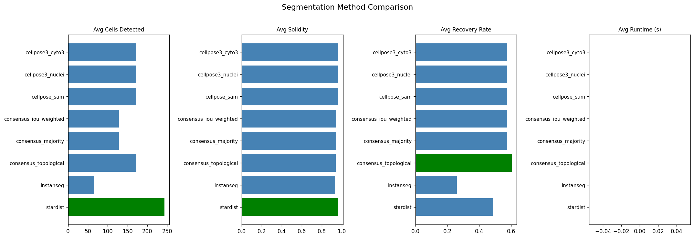

# Segmentation Benchmark Report

**Methods evaluated:** 8  
**FOVs per method:** 5

## Summary

| Method | Avg Cells | Avg Solidity | Avg Recovery | Avg Runtime (s) |
|--------|----------:|-------------:|-------------:|----------------:|
| cellpose3_cyto3 | 172 | 0.962 | 0.574 | 0.00 |
| cellpose3_nuclei | 172 | 0.962 | 0.574 | 0.00 |
| cellpose_sam | 172 | 0.962 | 0.574 | 0.00 |
| consensus_iou_weighted | 128 | 0.947 | 0.574 | 0.00 |
| consensus_majority | 128 | 0.947 | 0.574 | 0.00 |
| consensus_topological | 172 | 0.939 | 0.604 | 0.00 |
| instanseg | 65 | 0.933 | 0.260 | 0.00 |
| stardist | 243 | 0.965 | 0.487 | 0.00 |

## Comparison Chart

## Per-Method FOV Breakdown

### cellpose3_cyto3

| FOV | Cells | Solidity | Recovery | Runtime (s) |
|-----|------:|---------:|---------:|------------:|
| dense | 48 | 0.967 | 0.043 | 0.00 |
| edge | 186 | 0.967 | 0.527 | 0.00 |
| immune | 322 | 0.970 | 0.868 | 0.00 |
| mixed | 256 | 0.969 | 0.575 | 0.00 |
| sparse | 46 | 0.936 | 0.857 | 0.00 |

### cellpose3_nuclei

| FOV | Cells | Solidity | Recovery | Runtime (s) |
|-----|------:|---------:|---------:|------------:|
| dense | 48 | 0.967 | 0.043 | 0.00 |
| edge | 186 | 0.967 | 0.527 | 0.00 |
| immune | 322 | 0.970 | 0.868 | 0.00 |
| mixed | 256 | 0.969 | 0.575 | 0.00 |
| sparse | 46 | 0.936 | 0.857 | 0.00 |

### cellpose_sam

| FOV | Cells | Solidity | Recovery | Runtime (s) |
|-----|------:|---------:|---------:|------------:|
| dense | 48 | 0.967 | 0.043 | 0.00 |
| edge | 186 | 0.967 | 0.527 | 0.00 |
| immune | 322 | 0.970 | 0.868 | 0.00 |
| mixed | 256 | 0.969 | 0.575 | 0.00 |
| sparse | 46 | 0.936 | 0.857 | 0.00 |

### consensus_iou_weighted

| FOV | Cells | Solidity | Recovery | Runtime (s) |
|-----|------:|---------:|---------:|------------:|
| dense | 43 | 0.961 | 0.043 | 0.00 |
| edge | 163 | 0.956 | 0.527 | 0.00 |
| immune | 208 | 0.943 | 0.868 | 0.00 |
| mixed | 188 | 0.943 | 0.575 | 0.00 |
| sparse | 38 | 0.934 | 0.857 | 0.00 |

### consensus_majority

| FOV | Cells | Solidity | Recovery | Runtime (s) |
|-----|------:|---------:|---------:|------------:|
| dense | 43 | 0.961 | 0.043 | 0.00 |
| edge | 163 | 0.956 | 0.527 | 0.00 |
| immune | 208 | 0.943 | 0.868 | 0.00 |
| mixed | 188 | 0.943 | 0.575 | 0.00 |
| sparse | 38 | 0.934 | 0.857 | 0.00 |

### consensus_topological

| FOV | Cells | Solidity | Recovery | Runtime (s) |
|-----|------:|---------:|---------:|------------:|
| dense | 197 | 0.951 | 0.185 | 0.00 |
| edge | 166 | 0.938 | 0.531 | 0.00 |
| immune | 235 | 0.940 | 0.858 | 0.00 |
| mixed | 213 | 0.932 | 0.591 | 0.00 |
| sparse | 50 | 0.933 | 0.857 | 0.00 |

### instanseg

| FOV | Cells | Solidity | Recovery | Runtime (s) |
|-----|------:|---------:|---------:|------------:|
| dense | 2 | 0.928 | 0.002 | 0.00 |
| edge | 103 | 0.939 | 0.316 | 0.00 |
| immune | 17 | 0.935 | 0.049 | 0.00 |
| mixed | 189 | 0.938 | 0.435 | 0.00 |
| sparse | 16 | 0.926 | 0.500 | 0.00 |

### stardist

| FOV | Cells | Solidity | Recovery | Runtime (s) |
|-----|------:|---------:|---------:|------------:|
| dense | 409 | 0.961 | 0.272 | 0.00 |
| edge | 98 | 0.970 | 0.276 | 0.00 |
| immune | 225 | 0.972 | 0.618 | 0.00 |
| mixed | 414 | 0.960 | 0.555 | 0.00 |
| sparse | 71 | 0.962 | 0.714 | 0.00 |
